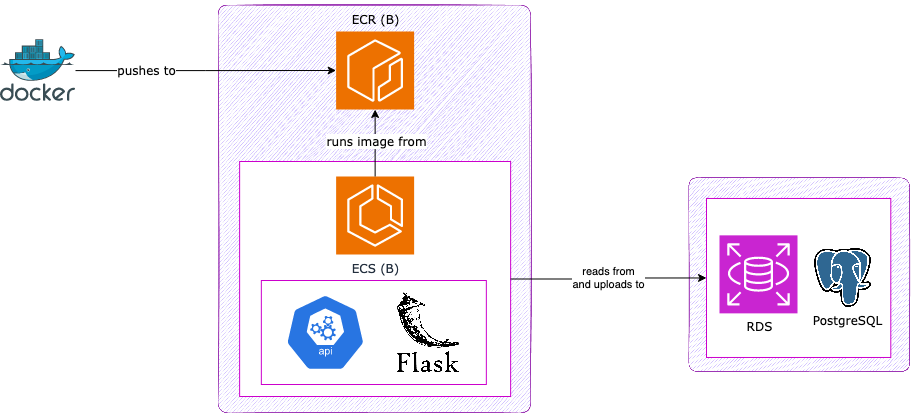

# API
Files in this folder are used in the production of a RESTful API implemented using the python library Flask.

## :hammer_and_wrench: Getting Setup

1. `pip install -r requirements.txt` - command to install all necessary requirements to working directory

## 🔐 Environment Variables
- Create a `.env` file with the following information:
- `DATABASE_IP` -> ARN to your AWS RDS.
- `DATABASE_NAME` -> Name of your database.
- `DATABASE_USERNAME` -> Your database username.
- `DATABASE_PASSWORD` -> Password to access your database.
- `DATABASE_PORT` -> Port used to access the database.

## 🏃 Running the api locally

Run the command `python3 api.py`

## API endpoints

API endpoints (note query parameters are to be conjoined with `&` and appended to their root URL following a `?`, as required):
 - `GET /ride` - HTML text instructions on how to use below endpoint:
    - `GET /ride/:id` - Get a ride with a specific ID; query params:
        - `expanded=true` - Fetch all readings associated with ride;
        - `summary=true` - Summarise all readings associated with ride.
 - `DELETE /ride/:id` - Delete a with a specific ID
 - `GET /rider` - HTML text instructions on how to use the following two endpoints:
    - `GET /rider/:rider_id` - Get rider information (e.g. name, gender, age, avg. heart rate, number of rides)
    - `GET /rider/:rider_id/rides` - Get all rides for a rider with a specific ID; query params:
        - `expanded=true` - Fetch all readings associated with each ride;
        - `summary=true` - Summarise all readings associated with each ride.
 - `GET /daily` - Get all of the rides in the current day; query params:
    - `expanded=true` - Fetch all readings associated with each ride;
    - `summary=true` - Summarise all readings associated with each ride.
 - `GET /daily?date=01-01-2020` - Get all rides for a specific date

### Requirements (as per `requirements.txt`)
- python-dotenv
- flask
- flask-caching~
- psycopg2-binary
- pytest

## ☁️ Cloud Architecture:

## :card_index_dividers: Files Explained
 

 ## `api.py`
 Contains the endpoint of the flask API, as well as the app itself; very light on processing.

 ### Requirements
 - flask
 - flask-caching
 - api_functions
 - database_functions

 

 ## `api_functions.py`
 Contains the bulk of the processing for the API; functions within act as go-betweens for the endpoints (which interact directly with users; contained within `api.py`) and the database functions (which interact directly with the database; contained within `database_functions.py`), and as such are eminently testable (in light of this, processing has been pushed into these functions from `api.py` and `database_functions.py` wherever possible, meaning testing it covers the bulk of the testable functionality of the api).

 ### Requirements
 - psycopg2-binary
 - api_helper_functions
 - database_functions

 

 ## `test_api_functions.py`
 Contains unit tests for the module `api_functions.py`.

 ### Requirements
 - pytest
 - api_functions
 - psycopg2-binary

 

 ## `api_helper_functions.py`
 Contains helper functions that are used for processing by functions in `api_functions.py`, but that do not directly interact with either `api.py` or `database_functions.py`.

 Exists almost for the sake of purity right now, but would prove increasingly useful as the functionality of the API is increased.

 

 ## `test_api_helper_functions.py`
 Contains unit tests for the module `api_helper_functions.py`.

 ### Requirements
 - pytest
 - api_helper_functions

 

## `database_functions.py`
Contains functions that interact directly with the database to fetch, update and delete data for the API.

### Requirements
- dotenv
- psycopg2-binary

### Environment Variables
- DATABASE_IP
- DATABASE_USERNAME
- DATABASE_NAME
- DATABASE_PASSWORD
- DATABASE_PORT
